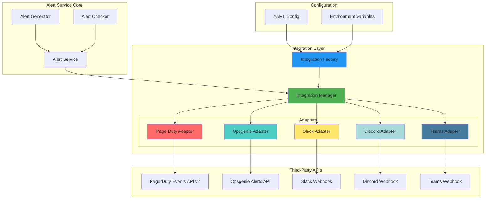

# Alert Service - Third-Party Integration Architecture

## 架构概览

该架构实现了可扩展的告警平台集成系统，支持多个第三方平台同时接收告警通知，具备失败重试、优先级路由和备用通道等企业级特性。

## 架构图



## 核心组件

### 1. Integration Interface (统一接口)

所有第三方平台适配器必须实现的接口：

```go
type Integration interface {
    Name() string
    SendAlert(ctx context.Context, alert *domain.Alert) error
    ResolveAlert(ctx context.Context, alertID string) error
    UpdateAlert(ctx context.Context, alertID string, status domain.AlertStatus) error
    ValidateConfig() error
    HealthCheck(ctx context.Context) error
}
```

**设计原则**：
- 统一抽象：所有平台通过相同接口调用
- 上下文控制：支持超时和取消
- 错误类型化：区分可重试和不可重试错误
- 健康检查：支持运行时平台可用性检测

### 2. Integration Manager (集成管理器)

负责协调多个集成平台的核心组件：

**核心功能**：
- 集成注册与注销
- 并发发送告警到所有启用平台
- 优先级路由（数字越小优先级越高）
- 自动重试机制（指数退避）
- 指标收集（成功率、响应时间）

**并发模型**：
```go
// 并发发送到所有集成
var wg sync.WaitGroup
for _, integration := range enabledIntegrations {
    wg.Add(1)
    go func(i Integration) {
        defer wg.Done()
        sendWithRetry(ctx, i, alert)
    }(integration)
}
wg.Wait()
```

**容错策略**：
- 部分成功即为成功（至少一个平台收到告警）
- 失败的平台不影响其他平台
- 所有平台失败时返回错误

### 3. Platform Adapters (平台适配器)

#### PagerDuty Adapter
- **API**: Events API v2 (`https://events.pagerduty.com/v2/enqueue`)
- **特性**:
  - Deduplication Key（去重键）：使用alert ID
  - Severity Mapping: `critical/error/warning/info`
  - Auto-resolve支持
  - Acknowledge支持

**示例Payload**:
```json
{
  "routing_key": "R034EXAMPLE",
  "event_action": "trigger",
  "dedup_key": "alert-123",
  "payload": {
    "summary": "Device Offline",
    "severity": "critical",
    "source": "device-abc123",
    "timestamp": "2025-10-20T10:30:00Z"
  }
}
```

#### Opsgenie Adapter
- **API**: Alerts API v2 (`https://api.opsgenie.com/v2/alerts`)
- **特性**:
  - Priority Mapping: `P1-P5`
  - Team Routing（团队路由）
  - Rich Details（详细信息字段）
  - Tags支持

**示例Payload**:
```json
{
  "message": "Device Offline",
  "alias": "alert-123",
  "priority": "P1",
  "source": "device-abc123",
  "teams": [{"name": "network-ops"}],
  "tags": ["edgelink", "production", "device"],
  "details": {
    "device_id": "abc123",
    "severity": "critical"
  }
}
```

#### Slack Adapter
- **API**: Incoming Webhooks
- **特性**:
  - Block Kit格式化（富文本）
  - Color Coding（颜色编码）
  - Interactive Buttons（交互按钮）
  - Channel覆盖

**示例Payload**:
```json
{
  "username": "EdgeLink Alert Bot",
  "icon_emoji": ":rotating_light:",
  "attachments": [{
    "color": "#FF0000",
    "title": "Device Offline",
    "text": "Device has been offline for 5 minutes",
    "fields": [
      {"title": "Severity", "value": "critical", "short": true},
      {"title": "Type", "value": "device_offline", "short": true}
    ],
    "actions": [
      {"type": "button", "text": "Acknowledge", "style": "primary"},
      {"type": "button", "text": "Resolve", "style": "danger"}
    ],
    "ts": 1729423800
  }]
}
```

#### Discord Adapter
- **API**: Webhook
- **特性**:
  - Embed Messages（嵌入消息）
  - Decimal Color Values（十进制颜色）
  - Rich Fields（丰富字段）
  - Avatar/Username自定义

**示例Payload**:
```json
{
  "username": "EdgeLink Alert Bot",
  "avatar_url": "https://example.com/avatar.png",
  "embeds": [{
    "title": "Device Offline",
    "description": "Device has been offline for 5 minutes",
    "color": 16711680,
    "fields": [
      {"name": "Severity", "value": "critical", "inline": true},
      {"name": "Type", "value": "device_offline", "inline": true}
    ],
    "footer": {"text": "EdgeLink Alert Service"},
    "timestamp": "2025-10-20T10:30:00Z"
  }]
}
```

#### Microsoft Teams Adapter
- **API**: Incoming Webhook
- **特性**:
  - Adaptive Cards格式
  - Fact Sets（事实列表）
  - Action Buttons（操作按钮）
  - Theme Color（主题颜色）

**示例Payload**:
```json
{
  "type": "message",
  "themeColor": "FF0000",
  "attachments": [{
    "contentType": "application/vnd.microsoft.card.adaptive",
    "content": {
      "type": "AdaptiveCard",
      "version": "1.4",
      "body": [{
        "type": "TextBlock",
        "text": "Device Offline",
        "weight": "bolder",
        "size": "large"
      }, {
        "type": "FactSet",
        "facts": [
          {"title": "Severity", "value": "critical"},
          {"title": "Type", "value": "device_offline"}
        ]
      }],
      "actions": [{
        "type": "Action.OpenUrl",
        "title": "View Details",
        "url": "https://edgelink.example.com/alerts/123"
      }]
    }
  }]
}
```

## 配置管理

### 配置结构
```yaml
integrations:
  pagerduty:
    enabled: true
    priority: 1
    integration_key: "${PAGERDUTY_INTEGRATION_KEY}"
    severity_map:
      critical: "critical"
      high: "error"
    retry_config:
      max_retries: 3
      initial_delay: 2s
      backoff_factor: 2.0
```

### 优先级路由
- **Priority 1**: PagerDuty（24/7值班平台）
- **Priority 2**: Opsgenie（运维团队平台）
- **Priority 3**: Slack（团队协作通知）
- **Priority 4**: Discord（开发者社区）
- **Priority 5**: Teams（企业协作）

## 重试机制

### 指数退避策略
```
Attempt 0: 立即发送
Attempt 1: 等待 2s
Attempt 2: 等待 4s
Attempt 3: 等待 8s
...
Max delay: 30s
```

### 错误分类
```go
type IntegrationError struct {
    Integration string
    Operation   string
    AlertID     string
    Err         error
    Retryable   bool  // 关键字段
}
```

**可重试错误**:
- 5xx服务器错误
- 429 Rate Limit
- 网络超时
- 连接失败

**不可重试错误**:
- 4xx客户端错误（除429外）
- 配置错误
- 认证失败
- JSON序列化失败

## 指标收集

每个集成收集以下指标：

```go
type IntegrationMetrics struct {
    TotalSent       int64         // 总发送数
    SuccessCount    int64         // 成功数
    FailureCount    int64         // 失败数
    LastSentTime    time.Time     // 最后发送时间
    AvgResponseTime time.Duration // 平均响应时间
}
```

可用于监控和告警：
- 成功率 = SuccessCount / TotalSent
- 失败率 = FailureCount / TotalSent
- 平台可用性趋势

## 使用示例

### 基本使用
```go
// 1. 创建工厂和管理器
factory := integrations.NewFactory(logger)
manager, _ := factory.CreateManager(config)

// 2. 发送告警（自动发送到所有启用平台）
ctx := context.Background()
err := manager.SendAlert(ctx, alert)

// 3. 解决告警
err = manager.ResolveAlert(ctx, alertID)

// 4. 获取指标
metrics := manager.GetMetrics()
```

### 健康检查
```go
// 检查所有集成
results := manager.HealthCheck(ctx)
for name, err := range results {
    if err != nil {
        log.Printf("Platform %s is unhealthy: %v", name, err)
    }
}
```

### 动态添加集成
```go
// 运行时添加新集成
slackConfig := &slack.Config{...}
slackIntegration := slack.NewIntegration(slackConfig, logger)
manager.Register(slackIntegration, slackConfig)
```

## 扩展新平台

添加新平台只需4步：

1. **实现Integration接口**
```go
type NewPlatform struct {
    config *Config
    logger *zap.Logger
}

func (n *NewPlatform) SendAlert(ctx context.Context, alert *domain.Alert) error {
    // 实现发送逻辑
}
```

2. **定义配置结构**
```go
type Config struct {
    Enabled     bool
    Priority    int
    APIKey      string
    RetryConfig integrations.RetryConfig
}
```

3. **在Factory中注册**
```go
case "newplatform":
    return newplatform.NewIntegration(cfg, logger), nil
```

4. **更新配置文件**
```yaml
integrations:
  newplatform:
    enabled: true
    priority: 6
```

## 安全考虑

1. **敏感信息保护**
   - API Key从环境变量读取
   - 配置文件不包含敏感信息
   - 日志中不记录完整Token

2. **HTTPS通信**
   - 所有API调用使用HTTPS
   - 验证SSL证书

3. **速率限制**
   - 尊重平台速率限制
   - 429错误自动重试

4. **超时控制**
   - 默认超时10-15秒
   - 支持context取消

## 性能优化

1. **并发发送**
   - 多平台并行通知
   - 不阻塞告警处理流程

2. **连接池**
   - 复用HTTP连接
   - 减少握手开销

3. **批量处理**（未来）
   - 支持批量告警发送
   - 减少API调用次数

## 监控和可观测性

推荐监控指标：
- `alert_integration_send_total` - 发送总数（按平台、状态）
- `alert_integration_send_duration_seconds` - 发送耗时
- `alert_integration_health_status` - 健康状态

推荐告警规则：
- 平台失败率 > 50%（5分钟）
- 平台连续失败 > 10次
- 平台平均响应时间 > 5秒
- 所有平台不可用

## 文件清单

```
backend/cmd/alert-service/internal/
├── integrations/
│   ├── integration.go         # 核心接口定义
│   ├── manager.go             # 集成管理器
│   ├── factory.go             # 集成工厂
│   ├── pagerduty/
│   │   └── pagerduty.go       # PagerDuty适配器
│   ├── opsgenie/
│   │   └── opsgenie.go        # Opsgenie适配器
│   ├── slack/
│   │   └── slack.go           # Slack适配器
│   ├── discord/
│   │   └── discord.go         # Discord适配器
│   ├── teams/
│   │   └── teams.go           # Teams适配器
│   └── examples/
│       └── examples.go        # 使用示例
└── config/
    └── integrations.go        # 配置结构

backend/cmd/alert-service/config/
└── integrations.example.yaml  # 配置示例
```

## 测试建议

1. **单元测试**
   - 各平台适配器独立测试
   - Mock HTTP客户端
   - 测试错误处理和重试

2. **集成测试**
   - 使用测试Webhook
   - 验证实际API调用
   - 测试并发场景

3. **端到端测试**
   - 真实环境测试
   - 验证告警流程
   - 性能压测

## 未来增强

1. **异步发送队列**
   - 使用消息队列解耦
   - 提高吞吐量
   - 持久化重试

2. **智能路由**
   - 基于告警严重程度路由
   - 时间窗口路由（工作时间/非工作时间）
   - 地域路由

3. **更多平台**
   - VictorOps/Splunk On-Call
   - Datadog
   - 企业微信
   - 钉钉

4. **双向集成**
   - 接收平台反馈（Acknowledge/Resolve）
   - Webhook回调处理
   - 状态同步
