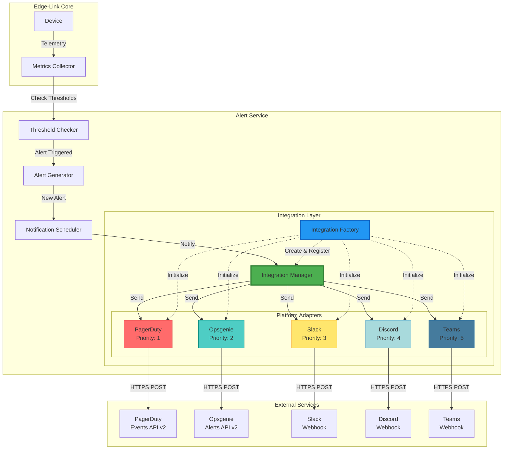
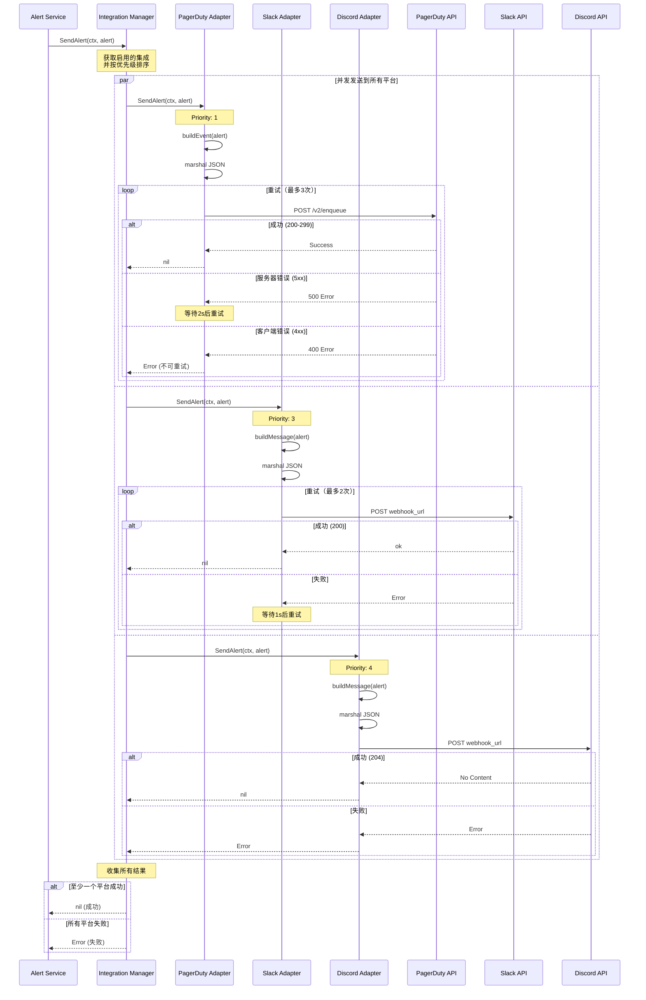
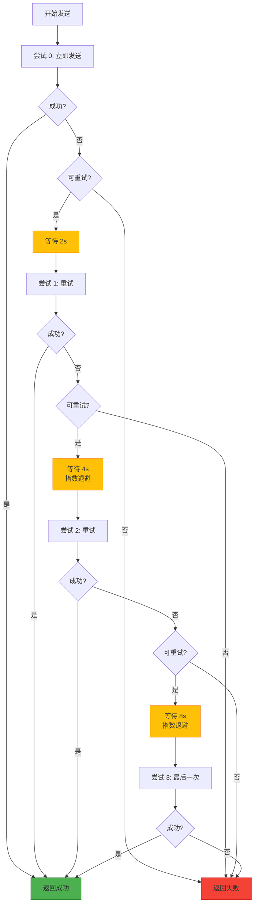
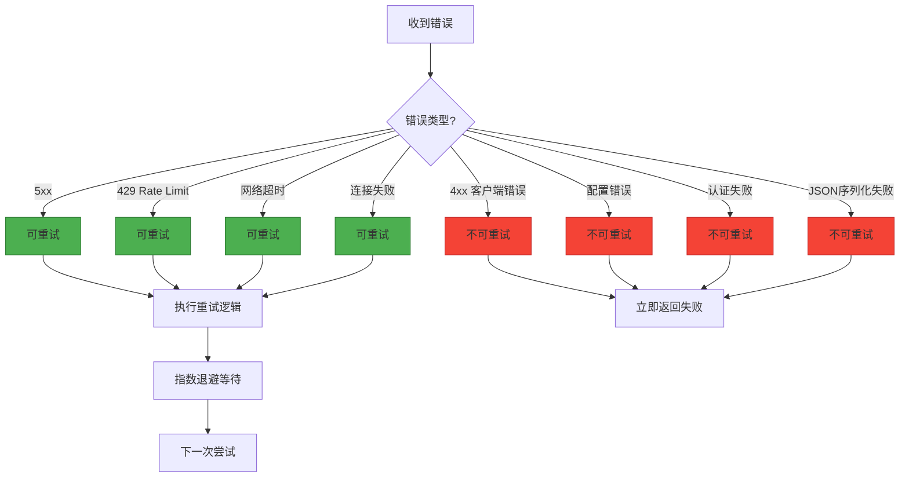
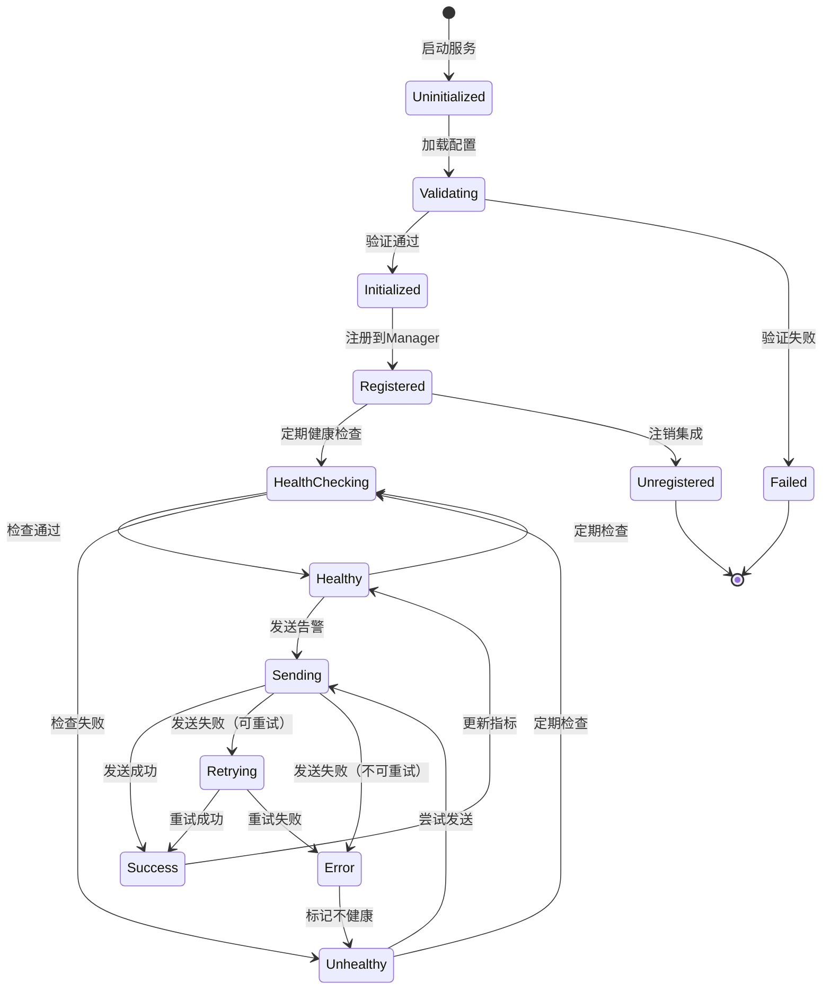
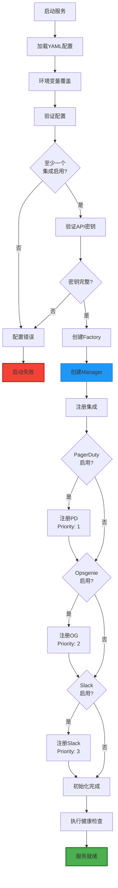
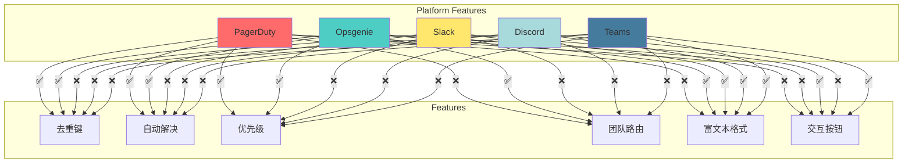
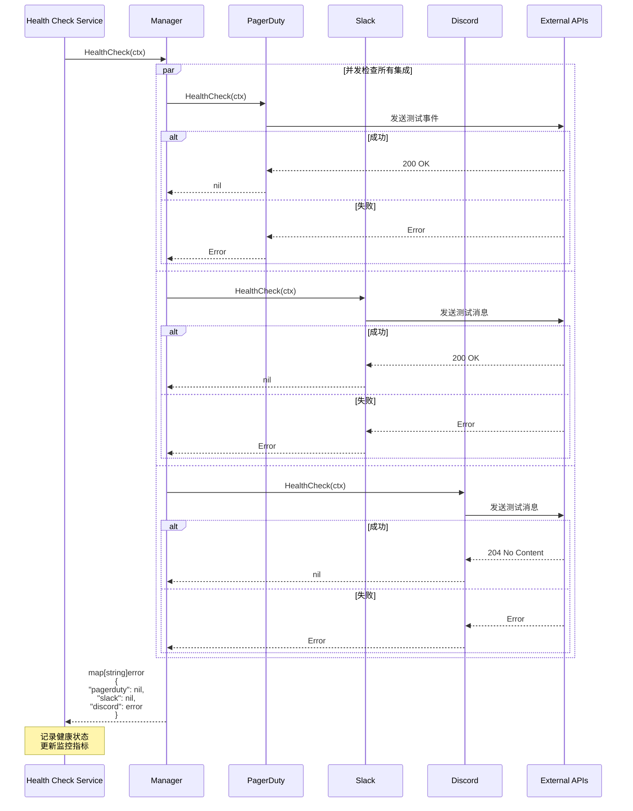

# Alert Service Integration Architecture Diagrams

## 1. 总体架构图



## 2. 告警发送流程



## 3. 重试机制流程



## 4. 错误分类决策树



## 5. 集成生命周期



## 6. 数据流图

```mermaid
graph LR
    subgraph "Input"
        Alert[Alert Entity]
    end

    subgraph "Processing"
        Manager[Integration Manager]

        subgraph "Transformation"
            PDTrans[PagerDuty<br/>Transform]
            OGTrans[Opsgenie<br/>Transform]
            SLTrans[Slack<br/>Transform]
        end

        subgraph "Serialization"
            PDJSON[PagerDuty<br/>JSON]
            OGJSON[Opsgenie<br/>JSON]
            SLJSON[Slack<br/>JSON]
        end

        subgraph "HTTP Client"
            PDReq[PagerDuty<br/>Request]
            OGReq[Opsgenie<br/>Request]
            SLReq[Slack<br/>Request]
        end
    end

    subgraph "Output"
        PDAPI[PagerDuty<br/>API]
        OGAPI[Opsgenie<br/>API]
        SLAPI[Slack<br/>API]
    end

    Alert --> Manager

    Manager -->|Alert Data| PDTrans
    Manager -->|Alert Data| OGTrans
    Manager -->|Alert Data| SLTrans

    PDTrans -->|Event Struct| PDJSON
    OGTrans -->|Alert Struct| OGJSON
    SLTrans -->|Message Struct| SLJSON

    PDJSON -->|[]byte| PDReq
    OGJSON -->|[]byte| OGReq
    SLJSON -->|[]byte| SLReq

    PDReq -->|POST| PDAPI
    OGReq -->|POST| OGAPI
    SLReq -->|POST| SLAPI

    style Manager fill:#4CAF50
    style PDTrans fill:#FFE66D
    style OGTrans fill:#FFE66D
    style SLTrans fill:#FFE66D
```

## 7. 配置加载流程



## 8. 指标收集架构

```mermaid
graph TB
    subgraph "Integration Manager"
        Manager[Manager]
        MetricsMap[Metrics Map<br/>map[string]*Metrics]
    end

    subgraph "每个集成的指标"
        M1[PagerDuty Metrics]
        M2[Opsgenie Metrics]
        M3[Slack Metrics]
    end

    subgraph "指标内容"
        Fields[TotalSent: 100<br/>SuccessCount: 95<br/>FailureCount: 5<br/>AvgResponseTime: 200ms<br/>LastSentTime: 2025-10-20T10:30:00Z]
    end

    subgraph "外部监控"
        Prometheus[Prometheus]
        Grafana[Grafana]
        AlertManager[AlertManager]
    end

    Manager --> MetricsMap
    MetricsMap --> M1
    MetricsMap --> M2
    MetricsMap --> M3

    M1 --> Fields
    M2 --> Fields
    M3 --> Fields

    Manager -->|/metrics endpoint| Prometheus
    Prometheus --> Grafana
    Prometheus --> AlertManager

    style Manager fill:#4CAF50
    style MetricsMap fill:#2196F3
    style Prometheus fill:#E37222
    style Grafana fill:#F46800
```

## 9. 平台特性对比



## 10. 健康检查流程



这些图表展示了集成架构的各个方面，从整体架构到具体的流程细节，帮助理解系统的设计和工作原理。
