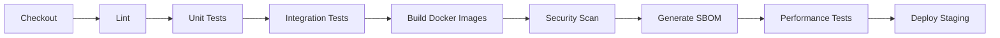
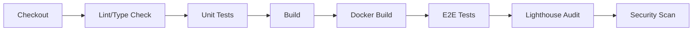

# CI/CD 管道文档

## 概述

Edge-Link 项目采用完整的 CI/CD 管道，确保代码质量、安全性和可靠部署。本文档记录所有自动化流程、质量门禁标准、失败处理机制和最佳实践。

## 工作流概览

### 核心工作流

| 工作流 | 触发条件 | 用途 | 超时时间 |
|--------|---------|------|---------|
| `backend.yml` | Push to main/develop, PR | 后端 CI/CD 管道 | 30分钟 |
| `frontend.yml` | Push to main/develop, PR | 前端 CI/CD 管道 | 20分钟 |
| `security-scan.yml` | Push, PR, 定时(每日2AM) | 安全漏洞扫描 | 45分钟 |
| `quality-gate.yml` | PR, Push to main/develop | 代码质量门禁 | 15分钟 |
| `release.yml` | Git tag (v*.*.*) | 发布和部署 | 60分钟 |
| `desktop-client.yml` | Push, PR | 桌面客户端构建 | 40分钟 |

## 1. 构建触发条件

### 1.1 事件类型定义

#### 完整构建 (Full Build)
- **触发条件**:
  - Push to `main` 或 `develop` 分支
  - Git tag 推送 (`v*.*.*`)
  - 手动触发 (workflow_dispatch)
- **执行内容**:
  - 完整的单元测试和集成测试
  - 代码覆盖率检查
  - Docker 镜像构建和推送
  - 安全扫描
  - SBOM 生成
  - 性能基准测试

#### 快速验证构建 (Quick Validation)
- **触发条件**:
  - Pull Request 创建或更新
- **执行内容**:
  - Linting 和格式检查
  - 单元测试
  - 代码覆盖率检查
  - 依赖审查
  - 不推送 Docker 镜像

### 1.2 触发策略

#### 路径过滤
```yaml
# 后端工作流只在后端代码变更时触发
paths:
  - 'backend/**'
  - '.github/workflows/backend.yml'

# 前端工作流只在前端代码变更时触发
paths:
  - 'frontend/**'
  - '.github/workflows/frontend.yml'
```

#### 分支保护规则
- **main 分支**:
  - 需要至少 1 个 review 批准
  - 必须通过所有状态检查
  - 必须更新到最新 commit
  - 禁止强制推送

- **develop 分支**:
  - 需要至少 1 个 review 批准
  - 必须通过所有状态检查

### 1.3 超时和重试策略

| 作业类型 | 超时时间 | 重试次数 | 重试延迟 |
|---------|---------|---------|---------|
| Linting | 5分钟 | 0 | N/A |
| 单元测试 | 10分钟 | 1 | 30秒 |
| 集成测试 | 15分钟 | 1 | 60秒 |
| Docker 构建 | 20分钟 | 2 | 2分钟 |
| 安全扫描 | 30分钟 | 1 | 60秒 |
| 部署 | 15分钟 | 0 | N/A |

**超时配置示例**:
```yaml
jobs:
  test:
    timeout-minutes: 10
    steps:
      - uses: actions/checkout@v4
      - uses: nick-fields/retry@v2
        with:
          timeout_minutes: 5
          max_attempts: 2
          retry_wait_seconds: 30
          command: go test ./...
```

## 2. 构建步骤和依赖

### 2.1 后端构建流程



#### 详细步骤

1. **代码检出** (Checkout)
   - 输入: Git repository
   - 输出: 工作目录源代码
   - 工具: `actions/checkout@v4`

2. **Linting** (golangci-lint)
   - 输入: Go 源代码
   - 输出: Lint 报告 (SARIF 格式)
   - 工具: `golangci-lint v1.55.2`
   - 规则: gocyclo, dupl, goconst, misspell, ineffassign, staticcheck, gosec

3. **单元测试** (Unit Tests)
   - 输入: Go 源代码
   - 输出: 覆盖率报告 (coverage.out)
   - 命令: `go test -v -race -coverprofile=coverage.out -covermode=atomic ./...`
   - 质量门禁: 覆盖率 ≥ 80%

4. **集成测试** (Integration Tests)
   - 输入: Go 源代码, PostgreSQL, Redis 服务
   - 输出: 测试结果
   - 服务依赖:
     - PostgreSQL 15-alpine (健康检查)
     - Redis 7-alpine (健康检查)
   - 标签: `-tags=integration`

5. **Docker 镜像构建**
   - 输入: Dockerfile, 源代码
   - 输出: Docker 镜像 (多架构)
   - 平台: linux/amd64, linux/arm64
   - 缓存: GitHub Actions Cache
   - 标签策略: 版本号、分支名、commit SHA

6. **安全扫描** (详见 2.3 节)

7. **SBOM 生成**
   - 输入: Docker 镜像
   - 输出: SBOM (SPDX 和 CycloneDX 格式)
   - 工具: Syft, Anchore

8. **性能基准测试**
   - 输入: API 服务
   - 输出: 性能指标 (JSON)
   - 工具: k6
   - 阈值: P95 延迟 < 200ms, 错误率 < 1%

### 2.2 前端构建流程



#### 详细步骤

1. **Linting 和类型检查**
   - ESLint: 最大警告数 0
   - Prettier: 格式检查
   - TypeScript: 类型检查
   - 输出: eslint-report.json

2. **单元测试**
   - 输入: React 组件和业务逻辑
   - 输出: 覆盖率报告 (lcov.info, coverage-summary.json)
   - 工具: Vitest
   - 质量门禁: 覆盖率 ≥ 70%

3. **构建**
   - 输入: TypeScript 源代码
   - 输出: 优化的静态资源 (dist/)
   - 工具: Vite
   - 环境变量: VITE_API_URL, VITE_WS_URL

4. **E2E 测试**
   - 输入: 构建的前端 + 后端服务
   - 输出: Playwright 报告
   - 工具: Playwright
   - 浏览器: Chromium, Firefox, WebKit

5. **性能审计**
   - 输入: 构建的静态文件
   - 输出: Lighthouse 报告
   - 工具: Lighthouse CI
   - 指标: Performance, Accessibility, Best Practices, SEO

### 2.3 依赖漏洞扫描集成点

#### Snyk 扫描 (每日执行)
- **触发时间**: 每日 UTC 2:00 AM
- **扫描对象**:
  - Go 依赖 (go.mod, go.sum)
  - npm 依赖 (package.json, pnpm-lock.yaml)
- **严重性阈值**: High 及以上
- **输出**: SARIF 报告上传到 GitHub Security
- **配置**:
```yaml
- uses: snyk/actions/golang@master
  with:
    args: --severity-threshold=high --sarif-file-output=snyk-backend.sarif
```

#### Dependabot (自动 PR)
- **配置文件**: `.github/dependabot.yml`
- **检查频率**: 每周
- **自动合并**: 补丁版本更新 (需通过 CI)
- **支持生态系统**:
  - Go modules
  - npm
  - Docker
  - GitHub Actions

**dependabot.yml 示例**:
```yaml
version: 2
updates:
  - package-ecosystem: "gomod"
    directory: "/backend"
    schedule:
      interval: "weekly"
    open-pull-requests-limit: 10
    reviewers:
      - "security-team"
    labels:
      - "dependencies"
      - "go"

  - package-ecosystem: "npm"
    directory: "/frontend"
    schedule:
      interval: "weekly"
    versioning-strategy: increase
```

#### Dependency Review Action (PR 时执行)
- **触发**: 每个 Pull Request
- **检查内容**:
  - 新增依赖的许可证
  - 已知漏洞
  - 变更摘要
- **失败条件**:
  - 严重性 ≥ Moderate 的漏洞
  - 禁止的许可证 (GPL-3.0, AGPL-3.0)

#### Trivy 容器扫描
- **扫描时机**: Docker 镜像构建后
- **扫描内容**:
  - 操作系统软件包漏洞
  - 应用程序依赖漏洞
  - 配置问题
- **严重性**: CRITICAL, HIGH
- **输出**: SARIF 上传到 GitHub Security, JSON 报告保存 30 天

#### CodeQL 静态分析
- **支持语言**: Go, JavaScript/TypeScript
- **查询集**: security-extended, security-and-quality
- **执行频率**: 每次 Push 和 PR
- **自动修复**: 部分问题支持自动 PR

## 3. 测试和质量门禁

### 3.1 测试类型要求

| 测试类型 | 后端 | 前端 | 桌面客户端 | 必需 |
|---------|------|------|-----------|------|
| 单元测试 | ✅ | ✅ | ✅ | 是 |
| 集成测试 | ✅ | ❌ | ✅ | 是 |
| E2E 测试 | ❌ | ✅ | ✅ | 仅 main 分支 |
| 性能测试 | ✅ | ✅ (Lighthouse) | ❌ | 仅 main 分支 |
| 安全测试 | ✅ | ✅ | ✅ | 是 |

#### 单元测试标准
- **后端 (Go)**:
  - 框架: 标准库 `testing`
  - 覆盖率: ≥ 80%
  - 竞态检测: 启用 (`-race`)
  - Mock: `gomock`, `testify/mock`

- **前端 (React)**:
  - 框架: Vitest + Testing Library
  - 覆盖率: ≥ 70%
  - 快照测试: 关键组件
  - Mock: Vitest mock 功能

- **桌面客户端 (Go)**:
  - 框架: 标准库 `testing`
  - 覆盖率: ≥ 75%
  - 平台特定测试: 条件编译

#### 集成测试标准
- **数据库迁移测试**: 必须包含
- **API 端点测试**: 覆盖所有 REST/gRPC 端点
- **服务依赖**: 使用真实 PostgreSQL 和 Redis
- **清理**: 每个测试后清理数据

#### E2E 测试标准
- **前端**:
  - 工具: Playwright
  - 关键用户流程: 登录、设备管理、拓扑查看
  - 浏览器: Chromium, Firefox
  - 视频录制: 失败时

- **桌面客户端**:
  - 工具: Go 标准库
  - 场景: 安装、连接、断线重连
  - 平台: Linux, Windows, macOS

### 3.2 代码覆盖率阈值

#### 强制执行
```yaml
# 后端覆盖率检查
- name: Check coverage threshold
  run: |
    COVERAGE=$(go tool cover -func=coverage.out | grep total | awk '{print $3}' | sed 's/%//')
    if (( $(echo "$COVERAGE < 80" | bc -l) )); then
      echo "::error::Coverage ${COVERAGE}% is below threshold 80%"
      exit 1
    fi
```

```yaml
# 前端覆盖率检查
- name: Check coverage threshold
  run: |
    COVERAGE=$(jq '.total.lines.pct' coverage/coverage-summary.json)
    if (( $(echo "$COVERAGE < 70" | bc -l) )); then
      echo "::error::Coverage ${COVERAGE}% is below threshold 70%"
      exit 1
    fi
```

#### 覆盖率报告
- **工具**: Codecov
- **上传频率**: 每次测试运行后
- **PR 评论**: 自动生成覆盖率变化报告
- **失败条件**: 覆盖率下降 > 1%

#### 豁免规则
- 测试文件本身 (`*_test.go`, `*.test.ts`)
- 生成的代码 (`*.pb.go`, `*.gen.ts`)
- 第三方集成适配器 (需 Code Review 批准)

### 3.3 Linting 强制执行

#### Go (golangci-lint)
- **版本**: v1.55.2
- **超时**: 5分钟
- **启用的 linters**:
  - gocyclo (圈复杂度 ≤ 15)
  - dupl (重复代码检测)
  - goconst (常量提取)
  - misspell (拼写检查)
  - ineffassign (无效赋值)
  - staticcheck (静态分析)
  - gosec (安全检查)

- **配置文件**: `.golangci.yml`
```yaml
linters:
  enable:
    - gocyclo
    - dupl
    - goconst
    - misspell
    - ineffassign
    - staticcheck
    - gosec
    - govet
    - errcheck

linters-settings:
  gocyclo:
    min-complexity: 15
  dupl:
    threshold: 100
```

#### JavaScript/TypeScript (ESLint)
- **版本**: ^8.55.0
- **配置**: `.eslintrc.cjs`
- **最大警告数**: 0 (--max-warnings 0)
- **规则集**:
  - @typescript-eslint/recommended
  - react-hooks
  - react-refresh

- **自动修复**: 仅格式问题
```bash
pnpm lint --fix  # 本地开发
pnpm lint        # CI 中强制执行
```

#### Prettier (代码格式化)
- **前端**: 强制执行
- **检查命令**: `pnpm format:check`
- **配置**: `.prettierrc`
```json
{
  "semi": true,
  "singleQuote": true,
  "tabWidth": 2,
  "trailingComma": "es5"
}
```

### 3.4 统一质量门禁标准

#### 所有组件必须满足

| 检查项 | 标准 | 阻塞级别 |
|--------|------|---------|
| 编译/构建 | 无错误 | 阻塞 |
| Linting | 无错误，0警告 | 阻塞 |
| 单元测试 | 100% 通过 | 阻塞 |
| 代码覆盖率 | 后端≥80%, 前端≥70% | 阻塞 |
| 安全扫描 | 无 Critical/High 漏洞 | 阻塞 |
| 依赖审查 | 无禁止许可证 | 阻塞 |
| 格式检查 | 符合 Prettier/gofmt | 阻塞 |
| 集成测试 | 100% 通过 | 阻塞 |
| E2E 测试 | 100% 通过 | 警告 (仅 main) |
| 性能基准 | 无退化 > 10% | 警告 |

#### 质量门禁工作流
```yaml
# .github/workflows/quality-gate.yml
enforce-quality-gate:
  needs: [backend-quality, frontend-quality]
  steps:
    - name: Check quality gate status
      run: |
        if [ "${{ needs.backend-quality.result }}" != "success" ] || \
           [ "${{ needs.frontend-quality.result }}" != "success" ]; then
          echo "::error::Quality gate failed"
          exit 1
        fi
```

## 4. 产物管理

### 4.1 构建产物存储位置

#### Docker 镜像
- **Registry**: GitHub Container Registry (ghcr.io)
- **命名规范**: `ghcr.io/<owner>/edgelink-<service>:<tag>`
- **服务列表**:
  - edgelink-api-gateway
  - edgelink-alert-service
  - edgelink-background-worker
  - edgelink-frontend

**标签策略**:
```
v1.2.3                  # 语义化版本
v1.2.3-abc1234          # 版本 + commit SHA
main-abc1234            # 分支 + commit SHA
latest                  # 最新稳定版 (仅 main 分支)
latest-dev              # 最新开发版 (develop 分支)
```

#### 桌面客户端二进制
- **存储位置**: GitHub Releases
- **命名规范**: `edgelink-<platform>-<arch>`
- **平台支持**:
  - edgelink-linux-amd64
  - edgelink-linux-arm64
  - edgelink-windows-amd64
  - edgelink-darwin-amd64
  - edgelink-darwin-arm64

#### Helm Charts
- **存储位置**: GitHub Releases
- **包名称**:
  - edge-link-control-plane-<version>.tgz
  - edgelink-sidecar-<version>.tgz
- **索引文件**: index.yaml (Helm repository)

#### SBOM (软件物料清单)
- **存储位置**: GitHub Actions Artifacts
- **格式**: SPDX JSON, CycloneDX JSON
- **保留期**: 90 天
- **命名**: `sbom-<service>-<version>.spdx.json`

#### 其他产物
- **测试报告**: GitHub Actions Artifacts (30 天)
- **覆盖率报告**: Codecov (永久)
- **性能基准**: GitHub Actions Artifacts (30 天)
- **安全扫描**: GitHub Security Tab (永久)

### 4.2 产物保留策略

| 产物类型 | 开发版本 | 发布版本 | 清理规则 |
|---------|---------|---------|---------|
| Docker 镜像 | 7 天 | 90 天 | 保留最近 10 个 |
| 二进制文件 | N/A | 永久 | 仅发布版本 |
| Helm Charts | N/A | 永久 | 仅发布版本 |
| SBOM | 90 天 | 永久 | 自动清理 |
| 测试报告 | 30 天 | 90 天 | 自动清理 |
| 工件归档 | 7 天 | 30 天 | 自动清理 |

**自动清理脚本** (每周执行):
```bash
#!/bin/bash
# scripts/cleanup-artifacts.sh

# 清理旧的开发版 Docker 镜像 (保留最近 10 个)
gh api repos/:owner/:repo/packages \
  | jq -r '.[] | select(.name | contains("edgelink")) | .name' \
  | xargs -I {} gh api repos/:owner/:repo/packages/{}/versions \
  | jq -r 'sort_by(.created_at) | reverse | .[10:] | .[].id' \
  | xargs -I {} gh api --method DELETE repos/:owner/:repo/packages/versions/{}

# 清理过期的 Actions artifacts
gh api repos/:owner/:repo/actions/artifacts \
  | jq -r '.artifacts[] | select(.expired) | .id' \
  | xargs -I {} gh api --method DELETE repos/:owner/:repo/actions/artifacts/{}
```

### 4.3 产物校验和生成

#### SHA256 校验和
**生成时机**: 每个发布产物构建后

**桌面客户端**:
```bash
# Linux/macOS
shasum -a 256 edgelink-linux-amd64 > edgelink-linux-amd64.sha256

# Windows
certutil -hashfile edgelink-windows-amd64 SHA256 > edgelink-windows-amd64.sha256
```

**Helm Charts**:
```bash
cd release/
shasum -a 256 *.tgz > checksums.txt
```

**Docker 镜像** (自动):
- Docker manifest digest (sha256:...)
- 保存到 `image-digests.txt`

**汇总文件 (SHA256SUMS.txt)**:
```
abc123...  edgelink-linux-amd64
def456...  edgelink-windows-amd64
789ghi...  edge-link-control-plane-1.2.3.tgz
```

#### 签名 (可选)
- **工具**: GPG, Sigstore/Cosign
- **适用**: 生产发布版本
- **验证**:
```bash
# GPG 验证
gpg --verify SHA256SUMS.txt.sig SHA256SUMS.txt

# Cosign 验证 Docker 镜像
cosign verify ghcr.io/edgelink/edgelink-api-gateway:v1.2.3
```

### 4.4 产物完整性验证步骤

#### 发布前验证 (CI 自动执行)

1. **校验和验证**:
```yaml
- name: Verify checksums
  run: |
    cd release-bundle
    shasum -c SHA256SUMS.txt
```

2. **镜像扫描**:
```yaml
- name: Scan image for vulnerabilities
  uses: aquasecurity/trivy-action@master
  with:
    image-ref: ${{ steps.build.outputs.tags }}
    exit-code: '1'
    severity: 'CRITICAL,HIGH'
```

3. **SBOM 验证**:
```yaml
- name: Validate SBOM
  run: |
    # 检查 SBOM 格式
    sbom-tool validate -b sbom.spdx.json

    # 扫描 SBOM 中的漏洞
    grype sbom:sbom.spdx.json
```

4. **烟雾测试**:
```bash
# scripts/smoke-test.sh
#!/bin/bash
BASE_URL=$1

# 健康检查
curl -f ${BASE_URL}/health || exit 1

# API 版本
curl -f ${BASE_URL}/api/v1/version || exit 1

# Metrics 端点
curl -f ${BASE_URL}/metrics || exit 1

echo "✅ Smoke tests passed"
```

#### 用户验证 (下载后)

**验证脚本示例** (`scripts/verify-release.sh`):
```bash
#!/bin/bash
VERSION=$1

# 下载发布文件
wget https://github.com/edgelink/edge-link/releases/download/${VERSION}/SHA256SUMS.txt
wget https://github.com/edgelink/edge-link/releases/download/${VERSION}/edgelink-linux-amd64

# 验证校验和
sha256sum -c --ignore-missing SHA256SUMS.txt

# 验证 GPG 签名 (如果有)
if [ -f SHA256SUMS.txt.sig ]; then
  gpg --verify SHA256SUMS.txt.sig SHA256SUMS.txt
fi

echo "✅ Release verification complete"
```

## 5. 失败处理和回滚

### 5.1 构建失败通知机制

#### 通知渠道

| 事件类型 | Slack | Email | GitHub Issue | PagerDuty |
|---------|-------|-------|--------------|-----------|
| CI 失败 (PR) | ✅ | ❌ | ❌ | ❌ |
| CI 失败 (main) | ✅ | ✅ | ✅ | ❌ |
| 安全漏洞 (Critical) | ✅ | ✅ | ✅ | ✅ |
| 部署失败 | ✅ | ✅ | ✅ | ✅ |
| 性能退化 | ✅ | ❌ | ✅ | ❌ |

#### Slack 通知配置
```yaml
- name: Send Slack notification
  if: failure()
  uses: 8398a7/action-slack@v3
  with:
    status: ${{ job.status }}
    text: |
      ❌ Backend CI failed
      Branch: ${{ github.ref }}
      Commit: ${{ github.sha }}
      Author: ${{ github.actor }}
      Workflow: ${{ github.workflow }}
    webhook_url: ${{ secrets.SLACK_WEBHOOK }}
    fields: repo,message,commit,author,action,eventName,ref,workflow
```

**Slack Webhook 配置**:
- `SLACK_WEBHOOK`: 一般通知 (#ci-notifications)
- `SLACK_SECURITY_WEBHOOK`: 安全告警 (#security-alerts)

#### Email 通知
- **触发条件**: main 分支构建失败, 安全漏洞, 部署失败
- **收件人**:
  - 开发团队: dev-team@example.com
  - 安全团队: security@example.com (仅安全事件)
  - 运维团队: ops@example.com (仅部署事件)

#### GitHub Issue 自动创建
```yaml
- name: Create GitHub Issue on failure
  if: failure() && github.ref == 'refs/heads/main'
  uses: actions/github-script@v7
  with:
    script: |
      github.rest.issues.create({
        owner: context.repo.owner,
        repo: context.repo.repo,
        title: `🚨 CI Failure - ${context.workflow}`,
        body: `
          **Workflow**: ${context.workflow}
          **Run**: ${context.payload.repository.html_url}/actions/runs/${context.runId}
          **Branch**: ${context.ref}
          **Commit**: ${context.sha}
          **Author**: ${context.actor}

          Please investigate and fix.
        `,
        labels: ['ci-failure', 'high-priority']
      });
```

#### PagerDuty 集成
- **触发条件**: 生产部署失败, Critical 安全漏洞
- **严重性**: High
- **自动升级**: 15 分钟未确认则升级到 on-call manager

```yaml
- name: Trigger PagerDuty alert
  if: failure()
  uses: mateuszdrab/pagerduty-actions@v1
  with:
    integration-key: ${{ secrets.PAGERDUTY_INTEGRATION_KEY }}
    dedup-key: ${{ github.run_id }}
    event-action: trigger
    severity: critical
    summary: "Production deployment failed"
```

### 5.2 失败诊断信息

#### 收集的诊断数据
- 完整构建日志
- 失败的测试输出
- 错误堆栈跟踪
- 系统资源使用情况
- 依赖版本快照

#### 自动收集脚本
```yaml
- name: Collect diagnostic info on failure
  if: failure()
  run: |
    mkdir -p diagnostics

    # 系统信息
    uname -a > diagnostics/system-info.txt
    df -h > diagnostics/disk-usage.txt
    free -h > diagnostics/memory-usage.txt

    # Docker 信息
    docker ps -a > diagnostics/docker-ps.txt
    docker images > diagnostics/docker-images.txt

    # 构建日志
    cp -r logs/ diagnostics/

    # 依赖版本
    go version > diagnostics/go-version.txt
    go list -m all > diagnostics/go-deps.txt

- name: Upload diagnostic artifacts
  if: failure()
  uses: actions/upload-artifact@v4
  with:
    name: diagnostics-${{ github.run_id }}
    path: diagnostics/
    retention-days: 30
```

### 5.3 回滚流程

#### 自动回滚触发条件
- 部署后 5 分钟内错误率 > 5%
- 健康检查失败 > 3 次
- P95 延迟 > 基线的 200%
- 手动触发 (紧急情况)

#### Kubernetes 自动回滚
```yaml
- name: Deploy with Helm (atomic)
  run: |
    helm upgrade --install edge-link-prod \
      infrastructure/helm/edge-link-control-plane \
      --namespace edgelink-prod \
      --atomic \                    # 失败时自动回滚
      --timeout 15m \                # 15分钟超时
      --wait                         # 等待 pod ready
```

`--atomic` 标志确保:
1. 部署失败时自动回滚到上一版本
2. 不会留下半成品部署
3. 保持服务可用性

#### 手动回滚步骤
```bash
# 1. 查看部署历史
helm history edge-link-prod -n edgelink-prod

# 2. 回滚到上一版本
helm rollback edge-link-prod -n edgelink-prod

# 3. 回滚到特定版本
helm rollback edge-link-prod 5 -n edgelink-prod

# 4. 验证回滚
kubectl rollout status deployment -n edgelink-prod
./scripts/smoke-test.sh api.edgelink.example.com
```

#### 数据库迁移回滚
```bash
# 后端迁移工具支持 down migrations
cd backend
go run cmd/migrate/main.go down

# 验证数据完整性
go run cmd/migrate/main.go validate
```

#### 回滚验证标准
- [ ] 所有 Pods 处于 Running 状态
- [ ] 健康检查通过
- [ ] 错误率 < 1%
- [ ] P95 延迟在基线 ±10% 范围内
- [ ] 关键功能烟雾测试通过

### 5.4 边缘场景处理

#### 数据库迁移失败
**场景**: 新版本包含不兼容的数据库 schema 变更

**处理流程**:
1. 迁移脚本执行前自动备份数据库
2. 迁移失败时停止部署 (不更新应用)
3. 执行 down migration 恢复 schema
4. 从备份恢复数据 (如果 down migration 不足)
5. 通知 on-call DBA

**预防措施**:
- 使用双写策略 (同时支持旧和新 schema)
- 分阶段迁移 (先添加字段, 后删除)
- 在 staging 环境测试迁移

#### 配置错误导致启动失败
**场景**: 新版本引入的配置项缺失或格式错误

**处理流程**:
```yaml
- name: Validate configuration
  run: |
    # 使用 dry-run 模式验证配置
    helm template edge-link-prod \
      infrastructure/helm/edge-link-control-plane \
      --values infrastructure/helm/values-production.yaml \
      --debug

    # 验证 ConfigMap
    kubectl apply --dry-run=client \
      -f infrastructure/k8s/configmap-prod.yaml
```

**自动回滚**:
- Kubernetes Readiness Probe 失败 → 自动回滚
- 启动超时 (5 分钟) → 自动回滚

#### 依赖服务不可用
**场景**: Redis/PostgreSQL 连接失败

**处理流程**:
1. 应用启动时重试连接 (最多 30 次, 间隔 2 秒)
2. 超时后进入降级模式 (如果支持)
3. 通知运维团队
4. 如果必需服务不可用, 阻止部署

**健康检查**:
```go
func (h *HealthChecker) Check(ctx context.Context) error {
    // PostgreSQL 检查
    if err := h.db.PingContext(ctx); err != nil {
        return fmt.Errorf("database unavailable: %w", err)
    }

    // Redis 检查
    if err := h.redis.Ping(ctx).Err(); err != nil {
        return fmt.Errorf("redis unavailable: %w", err)
    }

    return nil
}
```

#### 网络分区导致部分节点不可达
**场景**: Kubernetes 集群网络问题

**处理流程**:
1. Kubernetes 自动隔离不健康节点
2. 在健康节点上重新调度 Pods
3. 监控告警通知运维团队
4. 如果超过 50% 节点不可用, 暂停部署

#### 镜像拉取失败
**场景**: Registry 不可用或镜像不存在

**处理流程**:
```yaml
spec:
  template:
    spec:
      imagePullPolicy: IfNotPresent  # 优先使用本地缓存
      containers:
      - name: api-gateway
        image: ghcr.io/edgelink/edgelink-api-gateway:v1.2.3
```

**预防措施**:
- 使用镜像缓存代理
- 在部署前预先拉取镜像到所有节点
- 设置镜像拉取超时和重试

## 6. 最佳实践

### 6.1 本地开发与 CI 一致性

#### 使用相同的构建工具版本
```bash
# .tool-versions (使用 asdf)
golang 1.21
nodejs 20.10.0
helm 3.13.0
kubectl 1.28.0
```

#### 本地运行 CI 检查
```bash
# 运行 linting
make lint

# 运行测试
make test

# 运行完整 CI 流程
act -j test  # 使用 nektos/act 本地运行 GitHub Actions
```

### 6.2 加速构建

#### Go 模块缓存
```yaml
- uses: actions/cache@v4
  with:
    path: |
      ~/go/pkg/mod
      ~/.cache/go-build
    key: ${{ runner.os }}-go-${{ hashFiles('**/go.sum') }}
```

#### Docker Layer 缓存
```yaml
- uses: docker/build-push-action@v5
  with:
    cache-from: type=gha
    cache-to: type=gha,mode=max
```

#### 并行测试
```bash
go test -v -race -parallel=4 ./...
```

### 6.3 安全实践

#### Secrets 管理
- 使用 GitHub Secrets 存储敏感信息
- 定期轮换 secrets
- 限制 secret 访问权限
- 不在日志中打印 secrets

#### 最小权限原则
```yaml
permissions:
  contents: read      # 只读代码
  packages: write     # 写入镜像
  security-events: write  # 上传安全报告
```

### 6.4 监控和观测

#### CI/CD 指标
- 构建成功率
- 平均构建时间
- 部署频率
- 变更前置时间 (Lead Time)
- 平均恢复时间 (MTTR)

#### 使用 GitHub Insights
- Actions 使用量
- 缓存命中率
- Workflow 运行时长趋势

## 7. 故障排查

### 7.1 常见问题

#### 测试超时
**症状**: 测试运行超过配置的超时时间

**解决方案**:
1. 增加超时时间 (`timeout-minutes`)
2. 优化慢速测试
3. 并行运行测试
4. 使用测试缓存

#### Docker 构建失败
**症状**: `error building image`

**排查步骤**:
1. 检查 Dockerfile 语法
2. 验证基础镜像可用
3. 检查网络连接
4. 查看构建日志中的错误信息

#### 覆盖率下降
**症状**: 代码覆盖率低于阈值

**解决方案**:
1. 为新代码添加测试
2. 检查测试是否正确运行
3. 验证覆盖率计算逻辑
4. 临时降低阈值并创建 Issue 跟踪

#### 依赖安装失败
**症状**: `go mod download` 或 `pnpm install` 失败

**解决方案**:
1. 清理缓存重试
2. 检查 go.sum/pnpm-lock.yaml 完整性
3. 验证依赖仓库可访问
4. 使用镜像源 (国内环境)

### 7.2 调试技巧

#### 启用调试日志
```yaml
- name: Run tests with debug
  run: go test -v -race ./...
  env:
    DEBUG: "true"
    LOG_LEVEL: "debug"
```

#### SSH 调试 (使用 tmate)
```yaml
- name: Setup tmate session
  if: failure()
  uses: mxschmitt/action-tmate@v3
  timeout-minutes: 30
```

#### 保存失败时的工作目录
```yaml
- name: Upload workspace on failure
  if: failure()
  uses: actions/upload-artifact@v4
  with:
    name: failed-workspace
    path: .
```

## 附录

### A. 环境变量清单

| 变量名 | 用途 | 示例值 | 必需 |
|--------|------|--------|------|
| `GO_VERSION` | Go 版本 | `1.21` | 是 |
| `NODE_VERSION` | Node.js 版本 | `20` | 是 |
| `DOCKER_REGISTRY` | Docker 仓库 | `ghcr.io` | 是 |
| `SNYK_TOKEN` | Snyk API token | `***` | 是 |
| `CODECOV_TOKEN` | Codecov token | `***` | 否 |
| `SLACK_WEBHOOK` | Slack webhook URL | `https://hooks.slack.com/...` | 是 |

### B. Secrets 配置清单

| Secret 名称 | 用途 | 获取方式 |
|------------|------|---------|
| `GITHUB_TOKEN` | GitHub API 访问 | 自动提供 |
| `SNYK_TOKEN` | Snyk 扫描 | https://snyk.io |
| `SLACK_WEBHOOK` | Slack 通知 | Slack App 配置 |
| `KUBECONFIG_STAGING` | Staging 集群 | Base64 编码的 kubeconfig |
| `KUBECONFIG_PROD` | 生产集群 | Base64 编码的 kubeconfig |
| `CODECOV_TOKEN` | Codecov 上传 | https://codecov.io |
| `SONAR_TOKEN` | SonarCloud 分析 | https://sonarcloud.io |

### C. 相关文档链接

- [GitHub Actions 文档](https://docs.github.com/en/actions)
- [Helm 最佳实践](https://helm.sh/docs/chart_best_practices/)
- [Kubernetes 部署策略](https://kubernetes.io/docs/concepts/workloads/controllers/deployment/)
- [Docker 多阶段构建](https://docs.docker.com/build/building/multi-stage/)
- [Go 测试最佳实践](https://go.dev/doc/tutorial/add-a-test)

---

**文档版本**: v1.0
**最后更新**: 2025-10-21
**维护者**: Edge-Link DevOps 团队
